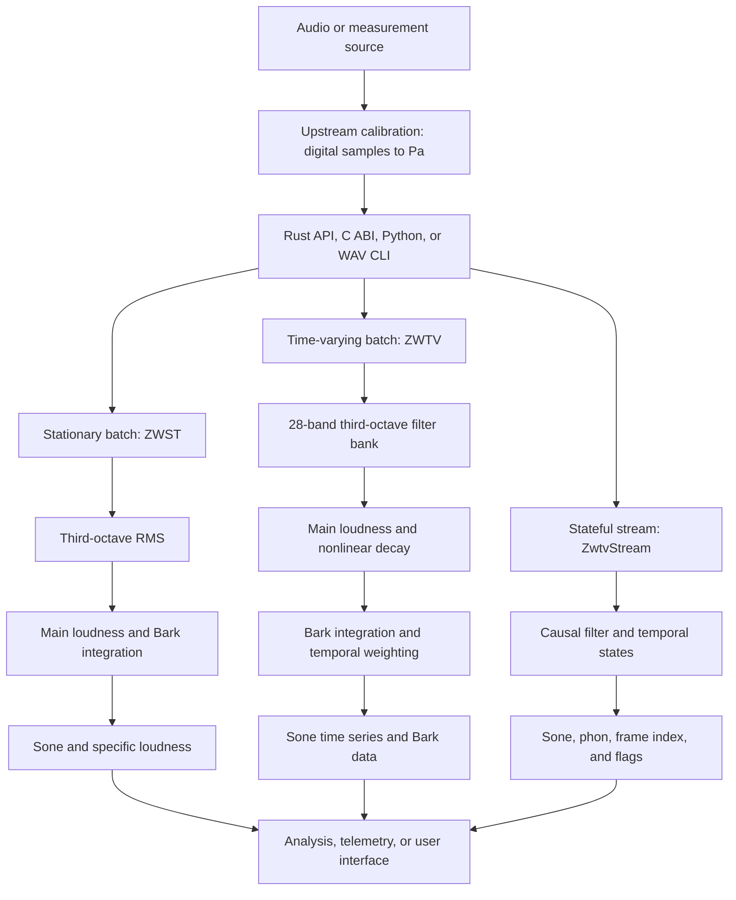

# ISO532

[繁體中文](README.zh-TW.md) | English

An AI-assisted Rust engine for ISO 532-1:2017 Zwicker loudness, built to add a perceptual-loudness view alongside dBFS, LUFS, and dB SPL monitoring.

> **Review draft — not yet announced as a public release.** The repository is tagged `v0.1.0`, but this README is being reviewed before publication. Measurements below describe specific checked-in tests and local hardware; they are not universal performance guarantees or a substitute for independent acoustics review.

## Why this project exists

I am an infrastructure engineer, not a professional acoustics or DSP software engineer. This project began as a practical attempt to help churches understand current listening conditions more easily: conventional meters such as dBFS, LUFS, and dB SPL remain essential, but they do not by themselves express perceived loudness in **sone**, **phon**, or **specific loudness over Bark**.

The engine was developed through human-directed AI collaboration, test-first iteration, reference comparison, and repeated code review. AI assistance does not make the implementation authoritative. Acoustic researchers, DSP engineers, Rust/C/Python maintainers, measurement specialists, live-sound engineers, and other reviewers are warmly invited to inspect the assumptions, reproduce the evidence, identify mistakes, and help improve the project.

## What it provides

- ISO 532-1 stationary loudness (`loudness_zwst`)
- ISO 532-1 time-varying loudness (`loudness_zwtv`)
- Total loudness in **sone** and specific loudness in **sone/Bark**
- Sone-to-phon conversion
- A stateful 48 kHz streaming path with a 2 ms output grid
- Automatic AVX2+FMA dispatch on supported x86-64 CPUs, with a scalar fallback
- Rust, C ABI, and Python interfaces
- A small calibrated-WAV CLI example
- Locally reproducible MoSQITo 1.2.1 parity, ISO Annex B, SIMD, determinism, FFI, and Python tests (after following the golden-data regeneration SOP)

The engine consumes **calibrated acoustic pressure samples in pascals**, not raw dBFS values. It complements dBFS/LUFS/dB SPL monitoring; it does not replace those meters.

## Current boundaries

- Input sample rate is exactly **48,000 Hz**. Resampling belongs upstream.
- Input calibration from digital full scale to pascals is the integrator's responsibility.
- The Rust streaming hot path is tested for no allocation after construction and does not initialize Rayon; Python `push()` necessarily allocates NumPy outputs.
- The stream has 24 input samples of algorithmic latency and marks the first 580 output frames as warm-up.
- Batch ZWTV uses Rayon for throughput. Do not treat batch benchmarks as audio-callback deadline evidence.
- This repository does not provide a finished VST/DAW plug-in or observability dashboard.
- ARM uses the scalar path; no NEON kernel is implemented.
- Only ISO 532-1 loudness is implemented. Sharpness, roughness, tonality, and other standards are outside v0.1.0.

## Architecture



The stationary front end intentionally follows the MoSQITo-compatible spectrum path. The time-varying path uses the ISO-style third-octave filter bank, nonlinear decay, Bark integration, and temporal weighting. Scalar, AVX2, Rayon, binding, and streaming variants share the same core equations and are guarded by parity tests.

## Repository and data structures

```text
ISO532/
|-- iso532/                  Rust core, examples, integration tests, benchmarks
|   |-- src/dsp/             filters and reusable DSP primitives
|   |-- src/core/            main-loudness and Bark-slope equations
|   |-- src/zwst/            stationary orchestration
|   `-- src/zwtv/            batch and stateful streaming orchestration
|-- iso532-ffi/              C ABI crate and generated public header
|-- iso532-py/               PyO3/NumPy binding and Python tests
|-- tools/                   environment, golden, comparison, and benchmark tools
|-- docs/                    design evidence, SOPs, risk reports, and plans
|-- data/                    local Annex B and generated golden fixtures (gitignored)
|-- Cargo.toml               workspace manifest
`-- Cargo.lock               frozen Rust dependency graph
```

The public numeric data contract is:

| Path | Input | Output |
|---|---|---|
| ZWST batch | One-dimensional 48 kHz `f64`/`float64` pressure samples in Pa, plus `free` or `diffuse` field | Total `N: f64` in sone, `N_specific[240]` in sone/Bark, and `bark[240]` |
| ZWTV batch | Same pressure array and field | `N[frames]`, `N_specific[240, frames]` (Bark-major), `bark[240]`, and exact 2 ms `time[frames]` |
| Stream | Consecutive chunks of calibrated 48 kHz pressure samples | Zero or more frames containing sone, phon, frame index, and status flags; `flush()` returns the tail |
| C ABI | Caller-owned input and output pointers with explicit lengths | The same layouts flattened into caller-owned buffers; see `iso532-ffi/include/iso532.h` |

Local reference files follow this structure:

```text
data/
|-- annexb/                  ISO Annex B WAV/CSV/XLSX source fixtures
`-- golden/<signal>/        little-endian f64 stage/output files plus meta.json
tools/golden.sha256          manifest for the recorded generation environment
```

`data/` is intentionally not stored in Git. A fresh clone must regenerate it before running golden or direct MoSQITo parity tests.

## Quick start

Before using the engine, confirm that the input is 48 kHz, mono, contiguous `float64` pressure data in pascals. Do not pass normalized digital samples unless you have applied a traceable sample-to-pascal calibration. Choose `"free"` or `"diffuse"` to match the measurement setup; the library cannot infer the field condition.

### Rust

Build and test from the repository root:

```powershell
cargo build --release
cargo test
```

Stationary loudness:

```rust
use iso532::{loudness_zwst, FieldType};

fn main() -> Result<(), iso532::Iso532Error> {
    // Replace this with calibrated 48 kHz pressure samples in Pa.
    let pressure_pa = vec![0.0_f64; 48_000];
    let result = loudness_zwst(&pressure_pa, 48_000.0, FieldType::Free)?;
    println!("{:.3} sone", result.n);
    Ok(())
}
```

Time-varying loudness:

```rust
use iso532::{loudness_zwtv, FieldType};

fn analyze(pressure_pa: &[f64]) -> Result<(), iso532::Iso532Error> {
    let result = loudness_zwtv(pressure_pa, 48_000.0, FieldType::Free)?;
    println!("{} frames on a 2 ms grid", result.n.len());
    Ok(())
}
```

### Python

Build the local extension with Maturin:

```powershell
py -3.11 -m venv .venv
.venv\Scripts\python.exe -m pip install maturin numpy
.venv\Scripts\maturin.exe develop --release -m iso532-py\Cargo.toml
```

Batch API:

```python
import numpy as np
import iso532

pressure_pa = np.zeros(48_000, dtype=np.float64)  # calibrated Pa, contiguous
n, n_specific, bark, time_s = iso532.loudness_zwtv(
    pressure_pa, 48_000.0, "free"
)
```

Streaming API:

```python
stream = iso532.ZwtvStream("free")
n, n_phon, frame_index, flags = stream.push(pressure_pa[:480])
tail = stream.flush()
```

The Python input contract is contiguous `float64`. Streaming non-finite samples are zeroed and reported through flags; the batch and stream error semantics are deliberately different.

### C ABI

Build the shared library and include the generated header:

```powershell
cargo build -p iso532-ffi --release
```

The stable v1 declarations and buffer contracts are in [`iso532-ffi/include/iso532.h`](iso532-ffi/include/iso532.h). The API includes:

- `iso532_loudness_zwst`
- `iso532_loudness_zwtv`
- `iso532_stream_new` / `iso532_stream_push` / `iso532_stream_flush` / `iso532_stream_free`

Callers own all batch output buffers. A stream handle is single-threaded and must not be called concurrently.

### WAV CLI example

```powershell
cargo run -p iso532 --example cli -- path\to\mono-48k.wav --calib 0.632455532
```

`--calib` is a linear multiplier from normalized WAV samples to pascals. It is **not** a dB value. The example downmixes multichannel WAV input to mono and currently computes stationary, free-field loudness.

## Integration guide

| Consumer | Recommended interface | Notes |
|---|---|---|
| Rust service or offline analyzer | `iso532` crate | Batch ZWST/ZWTV or `ZwtvStream` |
| C, C++, Go, .NET, or another FFI host | `iso532-ffi` | Caller-owned buffers; frozen C ABI v1 |
| Python analysis, notebooks, validation | `iso532-py` | NumPy batch and streaming APIs; GIL released during core batch work |
| Shell/WAV check | `examples/cli.rs` | Demonstration only; calibration must be supplied |
| Prometheus/telemetry service | Rust stream or C stream | Export sone, phon, flags, and frame index; aggregate before high-cardinality export |
| Monitoring user interface | Rust or C stream API | Keep dBFS, LUFS, and dB SPL visible beside sone/phon; aggregate frames before display |

A safe panel pipeline is:

```text
audio interface -> known gain/sensitivity calibration -> pressure Pa at 48 kHz
                -> ISO532 stream -> sone/phon/flags -> time aggregation -> dashboard
```

Do not infer pascals from dBFS without a traceable microphone/interface calibration. Wrong calibration shifts every loudness result. Also avoid presenting sone or phon as a hearing-safety or legal-compliance measurement unless the complete measurement chain has been independently validated for that purpose.

## Performance

### Direct comparison with MoSQITo 1.2.1

Local measurement on 2026-07-20, Windows, `AMD64 Family 23 Model 113`, 12 logical processors, Python 3.11.9, NumPy 2.4.6. Both implementations processed the same deterministic 3-second, 48 kHz contiguous `float64` pressure signal. After one unmeasured warm-up, each path ran 30 consecutive measured iterations; the table reports the arithmetic mean and sample standard deviation. The Rust result was called through the Python binding, so binding overhead is included.

| Implementation | Mean for 3 s input (30 runs) | Sample SD | Relative to input duration | Relative speed |
|---|---:|---:|---:|---:|
| ISO532 Rust through Python binding | 12.449 ms | 0.448 ms | 240.99x real-time | 536.69x |
| MoSQITo 1.2.1 `loudness_zwtv` | 6.681004 s | 0.092088 s | 0.4490x real-time | 1.00x |

This is a single-machine engineering measurement, not a universal promise. MoSQITo prioritizes a documented, modular scientific Python toolbox; this project targets a narrower Rust engine and does not claim to replace the broader MoSQITo project.

Reproduce both the timing and the direct numerical comparison with the checked-in script (after preparing the local golden environment as described below):

```powershell
.venv\Scripts\python.exe tools\compare_mosqito.py
```

### Native Criterion measurements

Checked-in Criterion artifacts from the same 12-logical-processor host:

| 10 s / 480,000-sample workload | Forced scalar median | AVX2 median | AVX2 speedup |
|---|---:|---:|---:|
| ZWTV batch, 12 Rayon threads (2026-07-10) | 142.224 ms | 47.461 ms | 3.00x |
| ZWTV batch, 1 Rayon thread (2026-07-10) | 561.563 ms | 253.210 ms | 2.22x |
| ZWTV stream, 480-sample chunks (2026-07-17) | 353.346 ms | 226.921 ms | 1.56x |

Re-run on your target machine:

```powershell
cargo bench -p iso532 --bench loudness
$env:RAYON_NUM_THREADS='1'
cargo bench -p iso532 --bench loudness -- zwtv_10s
Remove-Item Env:RAYON_NUM_THREADS
```

Criterion `change:` output can compare runs made with different thread counts. Use absolute medians and record CPU/thread metadata.

## Accuracy and comparison method

MoSQITo 1.2.1 is the project's primary independent implementation baseline. ISO Annex B reference data is a separate standards-level check. They answer different questions and are not conflated.

### Inherited MoSQITo compatibility choices

The Rust implementation deliberately reproduces several MoSQITo 1.2.1 choices so that parity remains useful. These are engineering trade-offs or compatibility debt, not claims that MoSQITo is incorrect:

| Choice inherited or compared | Why it exists | Consequence in this project |
|---|---|---|
| ZWST uses MoSQITo's general `noct_spectrum` front end: third-order Butterworth bands, low-band `decimate`/zero-phase filtering, then whole-signal RMS | ISO 532-1 allows a compliant IEC 61260-1 class-1 spectrum analyzer for stationary loudness; SciPy's vectorized C routines are also practical for Python | The measured Annex B ZWST offset is about +0.82% / -0.76% for signals 3/5, inside ISO tolerance but different from the standard's own reference-filter values |
| Whole-signal RMS includes filter startup, without a discarded settling window | Simple reusable spectrum-tool semantics | A smaller signal-duration-dependent component is included in the ZWST result |
| MoSQITo's 44.1-to-48 kHz FFT resampling appears in the signal-3 reference lineage | Convenient input normalization in the Python toolbox | A small residual remains in that Annex B comparison; ISO532's public API instead requires 48 kHz input |
| ZWTV retains reference-style per-sample recursive filtering | The time-varying front end is prescriptive in ISO 532-1 | Python/NumPy cannot vectorize the whole recursion as effectively, so MoSQITo ZWTV is slower; that is not a numerical defect |
| Batch parity preserves `r8()` rounding and MoSQITo-compatible nonlinear-decay initialization/look-ahead behavior | It keeps stage and end-to-end golden comparisons diagnostically precise | The causal stream uses zero state and explicit latency instead, then marks 580 output frames as warm-up |
| MoSQITo 1.2.1 uses an endpoint-inclusive, duration-dependent time axis | It follows that Python API's existing output construction | ISO532 returns an exact 2 ms grid and compares loudness values separately from time-axis identity |

The detailed evidence and distinction between compatibility parity and ISO compliance are recorded in [`docs/MOSQITO-VS-ISO-BASELINE-STRATEGY-2026-07-05.md`](docs/MOSQITO-VS-ISO-BASELINE-STRATEGY-2026-07-05.md).

### Questions for reviewers

Acoustics, measurement, DSP, and statistics reviewers are especially invited to advise on:

1. Whether the public API should eventually add an opt-in ISO-reference ZWST front end while retaining MoSQITo-compatible behavior as the migration/default path.
2. If such a mode is added, what settling-window rule should be specified instead of choosing an arbitrary transient-discard duration.
3. What calibration-chain evidence and free-field/diffuse-field guidance are necessary before results are presented outside engineering analysis.
4. Whether public timing reports should retain the requested 30-run arithmetic mean plus sample SD/min/max, or add robust statistics such as median and percentiles for skewed/noisy machines.

### MoSQITo parity method

1. A pinned local MoSQITo 1.2.1 source archive and frozen Python dependencies create the reference environment.
2. `tools/gen_golden.py` runs public and selected stage-level MoSQITo functions on nine synthetic/Annex B signals.
3. It stores input, intermediate, and output arrays as little-endian `f64` golden artifacts.
4. Rust integration tests compare filter/DSP stages, stationary loudness, time-varying loudness, total loudness, specific loudness, Bark axes, and shapes.
5. `iso532-py/tests/test_parity_mosqito.py` also runs MoSQITo and the compiled Rust binding directly on the same nine signals (`rtol=1e-6`, `atol=1e-9`).
6. Scalar/AVX2, Rayon/sequential, deterministic hash, C ABI, and Python bitwise-contract tests detect changes introduced outside the reference algorithm.
7. `tools/golden.sha256` verifies the generated artifact set for the recorded environment. See [`docs/GOLDEN-REGEN-SOP.md`](docs/GOLDEN-REGEN-SOP.md) before regenerating it on another OS/libm.

The time-axis comparison is intentional: MoSQITo 1.2.1 uses a duration-dependent endpoint-inclusive axis, while ISO532 returns an exact `96 / 48,000 = 2 ms` grid. Loudness values, Bark axes, and specific loudness are compared to MoSQITo; the Rust time axis is independently frozen and Annex-B checked.

### Observed numerical differences

| Comparison | Worst observed absolute difference | Interpretation |
|---|---:|---|
| ZWST total `N` vs MoSQITo golden | 0 sone | Exact after the shared total-loudness quantization |
| ZWST `N_specific` vs MoSQITo golden | `8.2e-14` sone/Bark | Floating-point noise scale |
| ZWTV `N(t)` vs MoSQITo golden | `1.6e-14` sone | Floating-point noise scale |
| ZWTV `N_specific(t)` vs MoSQITo golden | `1.3e-9` sone/Bark | Worst case near a slope/rounding branch boundary |
| AVX2 vs Rust scalar `N(t)` | 0 | Bit-identical on the measured golden set |
| AVX2 vs Rust scalar `N_specific(t)` | `1.4e-9` sone/Bark | Expected FMA/rounding residue, test-guarded |
| Fresh 2026-07-20 3 s direct run, `N(t)` | `2.66e-15` sone | Same signal used for the performance comparison |
| Fresh 2026-07-20 3 s direct run, `N_specific(t)` | `3.46e-15` sone/Bark | Same signal used for the performance comparison |

The two fresh-run rows and the performance table were produced by `.venv\Scripts\python.exe tools\compare_mosqito.py`. The script uses `tools.iso532_testkit.contract_signal(3 * 48_000)`, warms up both implementations once, runs each 30 consecutive times, and reports arithmetic mean, sample SD, min/max, and the maximum absolute `N(t)` and `N_specific(t)` differences.

ISO Annex B uses the much broader acceptance expression `abs(error) <= 0.1 + 0.05 * abs(reference)`. For detailed signal 3/5/10 results and the distinction between implementation parity and Annex B compliance, see [`docs/ISO-ANNEXB-NUMERICAL-ERROR-2026-07-04.md`](docs/ISO-ANNEXB-NUMERICAL-ERROR-2026-07-04.md).

### Reproduce the evidence

Because `data/` is gitignored, a fresh clone must first follow [`docs/GOLDEN-REGEN-SOP.md`](docs/GOLDEN-REGEN-SOP.md). In short, place the pinned `mosqito-1.2.1.tar.gz` archive at the repository root, then run:

```powershell
bash tools/setup_env.sh
.venv\Scripts\python.exe tools\gen_golden.py
.venv\Scripts\python.exe tools\golden_manifest.py --verify
```

```powershell
# Core, FFI, deterministic, SIMD, and stream tests
cargo test

# Frozen time-varying output hashes
cargo test -p iso532 --test golden_zwtv dump_zwtv_output_hashes -- --ignored --nocapture

# Python smoke + direct MoSQITo parity (requires local golden environment)
$env:ISO532_REQUIRE_PARITY='1'
.venv\Scripts\python.exe -m pytest iso532-py\tests -q
Remove-Item Env:ISO532_REQUIRE_PARITY

# Verify locally generated golden artifacts
.venv\Scripts\python.exe tools\golden_manifest.py --verify
```

The `data/` fixtures are intentionally local/gitignored. Hosted CI does not by itself prove the local MoSQITo/Annex B golden chain.

## Acknowledgements and citation

This project gratefully acknowledges **MoSQITo**, its maintainers, contributors, Eomys, and the organizations that have continued the project. MoSQITo provided an accessible, documented, validated, and reproducible reference implementation that made this independent Rust comparison possible. The reference baseline used here is MoSQITo 1.2.1.

- [MoSQITo repository](https://github.com/Eomys/MoSQITo)
- [MoSQITo 1.2.1 documentation](https://mosqito.readthedocs.io/en/latest/)
- [MoSQITo time-varying Zwicker loudness API](https://mosqito.readthedocs.io/en/latest/source/reference/mosqito.sq_metrics.loudness.loudness_zwtv.loudness_zwtv.html)
- Green Forge Coop. *MOSQITO* (software). [https://doi.org/10.5281/zenodo.10629475](https://doi.org/10.5281/zenodo.10629475)
- R. San Millán-Castillo et al., “MOSQITO: an open-source and free toolbox for sound quality metrics in the industry and education,” INTER-NOISE 2021. [https://doi.org/10.3397/IN-2021-1767](https://doi.org/10.3397/IN-2021-1767)
- [ISO 532-1:2017 catalogue entry](https://www.iso.org/standard/63077.html)

Please cite MoSQITo in research or derived validation work according to its documentation and repository citation metadata. ISO532 is not affiliated with or endorsed by the MoSQITo project.

## Contributing and expert review

Constructive review is especially welcome in these areas:

- ISO 532-1 interpretation and Annex B acceptance
- Filter design, state initialization, numerical analysis, and SIMD equivalence
- Acoustic calibration from microphones/interfaces to pascals
- Real-time callback P99/P99.9 behavior, denormals, and host integration
- C ABI, Python wheels, portability, and ARM/NEON work
- Accessible visualization of sone, phon, Bark distributions, warm-up, and measurement confidence
- Church/live-sound operating practices and user comprehension

When reporting a result, please include the input provenance, calibration chain, sample rate, field type, CPU/OS, exact commit, and the command used. A disagreement backed by a reproducible fixture is more valuable than a reassuring but untestable claim.

Before contributing, read [CONTRIBUTING.md](CONTRIBUTING.md) and the
[Code of Conduct](CODE_OF_CONDUCT.md). Security-sensitive reports belong in the
private path described by [SECURITY.md](SECURITY.md). Release history and
third-party attribution are recorded in [CHANGELOG.md](CHANGELOG.md) and
[THIRD_PARTY_NOTICES.md](THIRD_PARTY_NOTICES.md).

## License

This repository is licensed under [Apache License 2.0](LICENSE). Third-party names, publications, standards, test data, and software remain subject to their respective rights and licenses.
