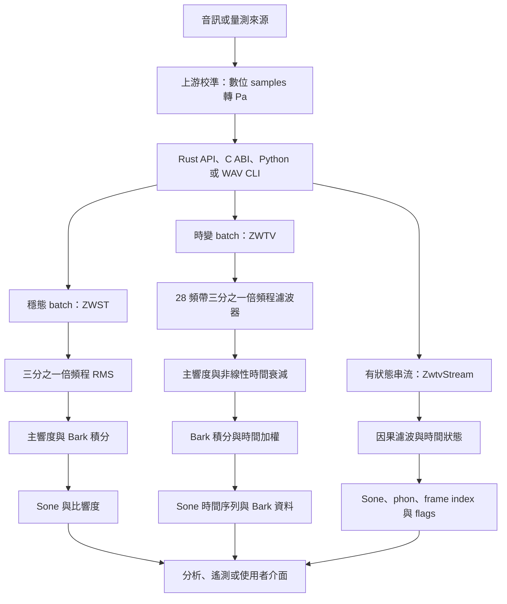

# ISO532

繁體中文 | [English](README.md)

這是一個以 AI 協作開發的 ISO 532-1:2017 Zwicker 響度 Rust 引擎，希望在 dBFS、LUFS 與 dB SPL 之外，增加一個描述聽感響度的可觀測面向。

> **審查稿，尚未對外宣布發布。** Repo 已標記 `v0.1.0`，但這份 README 會先經人工審查再決定是否發布。下列數據只代表指定測試與本機環境，不是所有硬體的效能保證，也不能取代獨立的聲學專業審查。

## 為什麼製作這個專案

我是一名 infra 工程師，不是專業聲學、DSP 或底層軟體工程師。製作這個引擎的起點很單純：希望幫助教會在既有 dBFS、LUFS、dB SPL 儀表之外，用更容易理解的方式觀察目前的聽感狀況，例如 **sone**、**phon**，以及 Bark 頻帶上的**比響度**。

本專案由人主導需求、判斷與驗證，並透過 AI 協作、測試優先、參照實作比對及多輪程式碼審查完成。使用 AI 不代表結果天然正確，也不代表這套實作具有權威性。誠摯邀請聲學研究者、DSP 工程師、Rust／C／Python 開發者、量測專家、現場音響工程師與各路先進，一起檢查假設、重現證據、指出錯誤並協助完善。

## 目前提供的能力

- ISO 532-1 穩態響度（`loudness_zwst`）
- ISO 532-1 時變響度（`loudness_zwtv`）
- 總響度 **sone** 與比響度 **sone/Bark**
- sone 轉 phon
- 48 kHz、有狀態、2 ms 輸出網格的串流處理
- 支援的 x86-64 CPU 自動使用 AVX2+FMA，否則回退 scalar
- Rust、C ABI 與 Python 介面
- 一個已校準 WAV 的簡易 CLI 範例
- 可於本機重現的 MoSQITo 1.2.1 parity、ISO Annex B、SIMD、確定性、FFI 與 Python 測試（須先依 golden 資料再生 SOP 建立環境）

引擎輸入是**已校準、單位為 Pa 的聲壓取樣**，不是原始 dBFS。它用來補充 dBFS／LUFS／dB SPL 的觀測面，不是取代這些儀表。

## 現階段限制

- 輸入取樣率必須恰為 **48,000 Hz**；重採樣應在上游完成。
- 數位 full scale 到 Pa 的校準由整合端負責。
- Rust 串流熱路徑在建立後通過零配置測試且不初始化 Rayon；Python `push()` 仍會配置 NumPy 輸出。
- 串流演算法延遲為 24 個輸入 samples，前 580 個輸出 frames 會標記為 warm-up。
- Batch ZWTV 使用 Rayon 增加吞吐量；batch benchmark 不能直接當作 audio callback deadline 證據。
- 本 repo 尚未提供完成的 VST／DAW plugin 或可觀測面板。
- ARM 目前使用 scalar，尚無 NEON kernel。
- v0.1.0 僅實作 ISO 532-1 響度；sharpness、roughness、tonality 及其他標準尚未納入。

## 架構圖



穩態前端刻意維持與 MoSQITo 相容的頻譜路徑；時變路徑則包含 ISO 形式的 1/3 倍頻程濾波、非線性衰減、Bark 積分與時間加權。Scalar、AVX2、Rayon、binding 與 streaming 版本共用同一套核心方程，並以 parity tests 看守。

## Repo 與資料結構

```text
ISO532/
|-- iso532/                  Rust core、examples、integration tests、benchmarks
|   |-- src/dsp/             filters 與可重用 DSP primitives
|   |-- src/core/            主響度與 Bark slope 方程
|   |-- src/zwst/            穩態流程編排
|   `-- src/zwtv/            batch 與有狀態 streaming 流程
|-- iso532-ffi/              C ABI crate 與產生完成的 public header
|-- iso532-py/               PyO3/NumPy binding 與 Python tests
|-- tools/                   環境、golden、比較及 benchmark 工具
|-- docs/                    設計證據、SOP、風險報告及計畫
|-- data/                    本機 Annex B 與 golden fixtures（gitignored）
|-- Cargo.toml               workspace manifest
`-- Cargo.lock               固定的 Rust dependency graph
```

公開數值 API 的資料契約如下：

| 路徑 | 輸入 | 輸出 |
|---|---|---|
| ZWST batch | 一維 48 kHz `f64`／`float64` Pa 聲壓 samples，加上 `free` 或 `diffuse` 聲場 | sone 單位的總響度 `N: f64`、`N_specific[240]` sone/Bark，以及 `bark[240]` |
| ZWTV batch | 相同的聲壓陣列與聲場 | `N[frames]`、Bark-major 的 `N_specific[240, frames]`、`bark[240]`，以及精確 2 ms 的 `time[frames]` |
| Stream | 依時間順序輸入的已校準 48 kHz chunks | 零或多筆包含 sone、phon、frame index、status flags 的 frames；`flush()` 取回尾端 |
| C ABI | Caller-owned input/output pointers 與明確 lengths | 相同 layout 攤平成 caller-owned buffers；詳見 `iso532-ffi/include/iso532.h` |

本機參照檔案採以下結構：

```text
data/
|-- annexb/                  ISO Annex B WAV/CSV/XLSX 原始 fixtures
`-- golden/<signal>/        little-endian f64 階段／輸出檔案及 meta.json
tools/golden.sha256          記錄生成環境的 manifest
```

`data/` 刻意不存入 Git；fresh clone 必須先重生，才能執行 golden 或直接 MoSQITo parity tests。

## 快速使用

使用前請先確認輸入為 48 kHz、mono、contiguous `float64`，且數值是單位為 Pa 的已校準聲壓。除非已有可追溯的 sample-to-Pa 校準，否則不要直接傳入 normalized digital samples。`"free"`／`"diffuse"` 必須依量測配置選擇，library 無法自行判斷聲場條件。

### Rust

在 repo 根目錄建置與測試：

```powershell
cargo build --release
cargo test
```

穩態響度：

```rust
use iso532::{loudness_zwst, FieldType};

fn main() -> Result<(), iso532::Iso532Error> {
    // 請換成已校準、48 kHz、單位 Pa 的聲壓 samples。
    let pressure_pa = vec![0.0_f64; 48_000];
    let result = loudness_zwst(&pressure_pa, 48_000.0, FieldType::Free)?;
    println!("{:.3} sone", result.n);
    Ok(())
}
```

時變響度：

```rust
use iso532::{loudness_zwtv, FieldType};

fn analyze(pressure_pa: &[f64]) -> Result<(), iso532::Iso532Error> {
    let result = loudness_zwtv(pressure_pa, 48_000.0, FieldType::Free)?;
    println!("2 ms 網格上共有 {} frames", result.n.len());
    Ok(())
}
```

### Python

使用 Maturin 建立本機 extension：

```powershell
py -3.11 -m venv .venv
.venv\Scripts\python.exe -m pip install maturin numpy
.venv\Scripts\maturin.exe develop --release -m iso532-py\Cargo.toml
```

Batch API：

```python
import numpy as np
import iso532

pressure_pa = np.zeros(48_000, dtype=np.float64)  # 已校準 Pa，且 contiguous
n, n_specific, bark, time_s = iso532.loudness_zwtv(
    pressure_pa, 48_000.0, "free"
)
```

Streaming API：

```python
stream = iso532.ZwtvStream("free")
n, n_phon, frame_index, flags = stream.push(pressure_pa[:480])
tail = stream.flush()
```

Python 輸入契約為 contiguous `float64`。串流遇到非有限值時會將該 sample 歸零並透過 flags 回報；batch 與 stream 的錯誤語意是刻意分開設計的。

### C ABI

建置 shared library，並使用產生完成的 header：

```powershell
cargo build -p iso532-ffi --release
```

穩定的 v1 宣告與 buffer 契約位於 [`iso532-ffi/include/iso532.h`](iso532-ffi/include/iso532.h)，主要 API 包含：

- `iso532_loudness_zwst`
- `iso532_loudness_zwtv`
- `iso532_stream_new` / `iso532_stream_push` / `iso532_stream_flush` / `iso532_stream_free`

Batch 輸出 buffers 全部由 caller 配置；stream handle 是單執行緒物件，不可被多執行緒同時呼叫。

### WAV CLI 範例

```powershell
cargo run -p iso532 --example cli -- path\to\mono-48k.wav --calib 0.632455532
```

`--calib` 是「正規化 WAV sample 轉換成 Pa」的線性倍率，**不是 dB 數值**。範例會把多聲道 WAV downmix 成 mono，目前只計算自由場穩態響度。

## 對接工具

| 使用情境 | 建議介面 | 注意事項 |
|---|---|---|
| Rust service 或離線分析器 | `iso532` crate | 可用 batch ZWST／ZWTV 或 `ZwtvStream` |
| C、C++、Go、.NET 或其他 FFI host | `iso532-ffi` | caller-owned buffers；C ABI v1 已凍結 |
| Python 分析、notebook、驗證 | `iso532-py` | NumPy batch／stream；核心 batch 計算期間會釋放 GIL |
| Shell／WAV 快速檢查 | `examples/cli.rs` | 僅供示範，必須提供校準倍率 |
| Prometheus／遙測服務 | Rust stream 或 C stream | 可匯出 sone、phon、flags、frame index；高 cardinality 前先聚合 |
| 監測使用者介面 | Rust 或 C stream API | sone／phon 應與 dBFS、LUFS、dB SPL 並列；顯示前先做時間聚合 |

建議的面板資料流：

```text
音訊介面 -> 已知 gain／麥克風靈敏度校準 -> 48 kHz 聲壓 Pa
         -> ISO532 stream -> sone／phon／flags -> 時間聚合 -> dashboard
```

沒有可追溯的麥克風／介面校準時，不可直接由 dBFS 猜測 Pa；校準錯誤會讓所有響度結果產生系統性偏移。若整條量測鏈尚未由專業單位獨立驗證，也不應把 sone 或 phon 包裝成聽力安全或法規合規判定。

## 效能比對

### 與 MoSQITo 1.2.1 的直接比對

2026-07-20 本機量測環境：Windows、`AMD64 Family 23 Model 113`、12 logical processors、Python 3.11.9、NumPy 2.4.6。兩者處理完全相同的 3 秒、48 kHz、contiguous `float64` deterministic 聲壓訊號；各先做一次不計入統計的 warm-up，再連續量測 30 次。表格使用算術平均與 sample standard deviation。Rust 由 Python binding 呼叫，所以數字包含 binding overhead。

| 實作 | 3 秒輸入平均（30 次） | Sample SD | 相對輸入時間 | 相對速度 |
|---|---:|---:|---:|---:|
| ISO532 Rust（經 Python binding） | 12.449 ms | 0.448 ms | 240.99x real-time | 536.69x |
| MoSQITo 1.2.1 `loudness_zwtv` | 6.681004 s | 0.092088 s | 0.4490x real-time | 1.00x |

這是單機工程量測，不是跨硬體承諾。MoSQITo 的目標是具文件、模組化的科學 Python toolbox；本專案只聚焦較窄的 Rust 引擎範圍，無意宣稱取代 MoSQITo 的完整能力。

依下文建立本機 golden 環境後，可用入庫腳本同時重現效能與直接數值比對：

```powershell
.venv\Scripts\python.exe tools\compare_mosqito.py
```

### Native Criterion 量測

同一台 12 logical processors 主機上保留的 Criterion artifacts：

| 10 秒／480,000 samples 工作量 | Forced scalar 中位數 | AVX2 中位數 | AVX2 加速 |
|---|---:|---:|---:|
| ZWTV batch，12 Rayon threads（2026-07-10） | 142.224 ms | 47.461 ms | 3.00x |
| ZWTV batch，1 Rayon thread（2026-07-10） | 561.563 ms | 253.210 ms | 2.22x |
| ZWTV stream，480-sample chunks（2026-07-17） | 353.346 ms | 226.921 ms | 1.56x |

在目標機器重跑：

```powershell
cargo bench -p iso532 --bench loudness
$env:RAYON_NUM_THREADS='1'
cargo bench -p iso532 --bench loudness -- zwtv_10s
Remove-Item Env:RAYON_NUM_THREADS
```

Criterion 的 `change:` 可能拿不同 thread count 的歷史結果互比；判讀時應看絕對中位數，並記錄 CPU 與執行緒資訊。

## 精度與比較方法

本專案以 MoSQITo 1.2.1 作為主要的獨立實作基準；ISO Annex B 則是另一層標準參考檢查。兩者回答不同問題，不會混為單一「精度」宣稱。

### 繼承自 MoSQITo 的相容性選擇

Rust 實作為了保留 parity 的診斷價值，刻意復刻 MoSQITo 1.2.1 的若干選擇。以下屬於工程取捨或相容性債，不代表 MoSQITo 的實作錯誤：

| 繼承或比對的選擇 | 原因 | 本專案的結果 |
|---|---|---|
| ZWST 使用 MoSQITo 通用 `noct_spectrum` 前端：三階 Butterworth bands、低頻 `decimate`／zero-phase filtering，再取全段 RMS | ISO 532-1 允許穩態法使用符合 IEC 61260-1 class 1 的頻譜分析器；SciPy vectorized C routines 也較符合 Python 效能現實 | Annex B signals 3/5 的 ZWST 實測偏差約 +0.82%／-0.76%，仍在 ISO 容差內，但與標準自身 reference-filter 數值不同 |
| 全段 RMS 包含 filter startup，沒有另丟棄 settling window | 通用 spectrum tool 的簡化與可重用語意 | ZWST 結果包含較小、會受訊號長度影響的暫態成分 |
| Signal 3 參照鏈包含 MoSQITo 的 44.1-to-48 kHz FFT resampling | Python toolbox 的便利性選擇 | 該 Annex B 比對保留小幅 residual；ISO532 公開 API 則要求呼叫端先提供 48 kHz |
| ZWTV 保留 reference-style 逐 sample 遞迴濾波 | ISO 532-1 對時變前端的規定較明確 | Python/NumPy 無法同樣有效地整段向量化，所以 MoSQITo ZWTV 較慢；這不是數值缺陷 |
| Batch parity 保留 `r8()` rounding 與 MoSQITo-compatible nonlinear-decay initialization／look-ahead 語意 | 讓逐階段與端對端 golden comparison 能精確定位回歸 | 因果 stream 改用 zero state 與明確 latency，並把前 580 個輸出 frames 標記為 warm-up |
| MoSQITo 1.2.1 使用包含終點、依 duration 改變間距的時間軸 | 延續既有 Python API 的輸出建立方式 | ISO532 改回精確 2 ms grid，響度 parity 與 time-axis identity 分開驗證 |

詳細證據，以及「相容性 parity」與「ISO compliance」的區別，請見 [`docs/MOSQITO-VS-ISO-BASELINE-STRATEGY-2026-07-05.md`](docs/MOSQITO-VS-ISO-BASELINE-STRATEGY-2026-07-05.md)。

### 後續請益

特別希望聲學、量測、DSP 與統計領域的審查者協助判斷：

1. 公開 API 是否應增加 opt-in ISO-reference ZWST 前端，同時保留 MoSQITo-compatible 行為作為遷移／預設路徑。
2. 若增加該模式，settling window 應依哪一條規則定義，避免任意指定暫態丟棄時間。
3. 在工程分析以外展示結果前，校準鏈證據及 free-field／diffuse-field 的選擇指引應做到什麼程度。
4. 公開效能報告是否應維持這次要求的「30 次算術平均 + sample SD／min／max」，或另加入 median、percentiles 等較能抵抗偏態與背景負載的統計量。

### MoSQITo parity 方法

1. 以本機固定的 MoSQITo 1.2.1 source archive 與凍結的 Python dependencies 建立參照環境。
2. `tools/gen_golden.py` 對九組合成／Annex B 訊號執行 MoSQITo public API 與選定的逐階段函式。
3. 輸入、中間陣列與輸出以 little-endian `f64` golden artifacts 保存。
4. Rust integration tests 逐項比對 filter／DSP、穩態響度、時變響度、總響度、比響度、Bark 軸與 shape。
5. `iso532-py/tests/test_parity_mosqito.py` 會對同九組訊號直接執行 MoSQITo 與編譯後 Rust binding（`rtol=1e-6`、`atol=1e-9`）。
6. Scalar／AVX2、Rayon／sequential、deterministic hash、C ABI 與 Python bitwise-contract tests，負責偵測參照演算法以外的工程變更。
7. `tools/golden.sha256` 驗證該環境產生的 artifacts；跨 OS／libm 重生前請先閱讀 [`docs/GOLDEN-REGEN-SOP.md`](docs/GOLDEN-REGEN-SOP.md)。

時間軸差異是刻意處理的：MoSQITo 1.2.1 使用包含終點、依 duration 改變間距的時間軸；ISO532 固定回傳 `96 / 48,000 = 2 ms` 網格。響度值、Bark 軸與比響度對 MoSQITo 比較；Rust 時間軸則獨立使用 bitwise freeze 與 Annex B 測試。

### 已觀測數值差異

| 比較項目 | 已觀測最大絕對差異 | 解讀 |
|---|---:|---|
| ZWST 總響度 `N` vs MoSQITo golden | 0 sone | 共用總響度量化後完全相同 |
| ZWST `N_specific` vs MoSQITo golden | `8.2e-14` sone/Bark | 浮點雜訊尺度 |
| ZWTV `N(t)` vs MoSQITo golden | `1.6e-14` sone | 浮點雜訊尺度 |
| ZWTV `N_specific(t)` vs MoSQITo golden | `1.3e-9` sone/Bark | 最差案例位於 slope／rounding 分支邊界附近 |
| AVX2 vs Rust scalar `N(t)` | 0 | 已量測 golden set 上 bit-identical |
| AVX2 vs Rust scalar `N_specific(t)` | `1.4e-9` sone/Bark | FMA／rounding 殘差，由測試看守 |
| 2026-07-20 直接 3 秒比對，`N(t)` | `2.66e-15` sone | 與效能量測相同訊號 |
| 2026-07-20 直接 3 秒比對，`N_specific(t)` | `3.46e-15` sone/Bark | 與效能量測相同訊號 |

上面兩列直接比對與效能表均由 `.venv\Scripts\python.exe tools\compare_mosqito.py` 產生。腳本使用 `tools.iso532_testkit.contract_signal(3 * 48_000)`，先各 warm up 一次，再各連續量測 30 次，輸出算術平均、sample SD、min／max，以及 `N(t)` 與 `N_specific(t)` 的最大絕對差異。

ISO Annex B 使用寬得多的接受式：`abs(error) <= 0.1 + 0.05 * abs(reference)`。Signal 3／5／10 的詳細數據，以及「實作 parity」與「Annex B compliance」的差異，請見 [`docs/ISO-ANNEXB-NUMERICAL-ERROR-2026-07-04.md`](docs/ISO-ANNEXB-NUMERICAL-ERROR-2026-07-04.md)。

### 重現驗證

因為 `data/` 已列入 gitignore，fresh clone 必須先依 [`docs/GOLDEN-REGEN-SOP.md`](docs/GOLDEN-REGEN-SOP.md) 建立本機資料。簡要步驟是先把固定版本的 `mosqito-1.2.1.tar.gz` 放在 repo 根目錄，再執行：

```powershell
bash tools/setup_env.sh
.venv\Scripts\python.exe tools\gen_golden.py
.venv\Scripts\python.exe tools\golden_manifest.py --verify
```

```powershell
# Core、FFI、deterministic、SIMD 與 stream tests
cargo test

# 凍結的時變輸出 hashes
cargo test -p iso532 --test golden_zwtv dump_zwtv_output_hashes -- --ignored --nocapture

# Python smoke + 直接 MoSQITo parity（需要本機 golden 環境）
$env:ISO532_REQUIRE_PARITY='1'
.venv\Scripts\python.exe -m pytest iso532-py\tests -q
Remove-Item Env:ISO532_REQUIRE_PARITY

# 驗證本機產生的 golden artifacts
.venv\Scripts\python.exe tools\golden_manifest.py --verify
```

`data/` fixtures 刻意只保存在本機並列入 gitignore；僅有 hosted CI 綠燈，不能單獨證明本機 MoSQITo／Annex B golden chain。

## 致謝與引用

本專案由衷感謝 **MoSQITo**、歷來維護者與貢獻者、Eomys，以及持續支持該專案的組織。MoSQITo 提供了容易取得、具文件、經驗證且可重現的參照實作，讓這次獨立 Rust 實作與比較成為可能。本專案使用的參照基準版本為 MoSQITo 1.2.1。

- [MoSQITo repository](https://github.com/Eomys/MoSQITo)
- [MoSQITo 1.2.1 文件](https://mosqito.readthedocs.io/en/latest/)
- [MoSQITo 時變 Zwicker 響度 API](https://mosqito.readthedocs.io/en/latest/source/reference/mosqito.sq_metrics.loudness.loudness_zwtv.loudness_zwtv.html)
- Green Forge Coop. *MOSQITO*（software）。[https://doi.org/10.5281/zenodo.10629475](https://doi.org/10.5281/zenodo.10629475)
- R. San Millán-Castillo et al., “MOSQITO: an open-source and free toolbox for sound quality metrics in the industry and education,” INTER-NOISE 2021。[https://doi.org/10.3397/IN-2021-1767](https://doi.org/10.3397/IN-2021-1767)
- [ISO 532-1:2017 catalogue entry](https://www.iso.org/standard/63077.html)

研究或衍生驗證工作若使用 MoSQITo，請依其官方文件與 repository citation metadata 正確引用。本專案與 MoSQITo 無隸屬關係，也未獲其背書。

## 敬邀協作與專家審查

特別期待下列領域的具體建議：

- ISO 532-1 解讀與 Annex B 驗收方法
- 濾波器設計、狀態初始化、數值分析與 SIMD 等價性
- 麥克風／介面到 Pa 的聲學校準
- Real-time callback P99／P99.9、denormal 與 host 整合
- C ABI、Python wheels、可攜性與 ARM／NEON
- Sone、phon、Bark 分布、warm-up 與量測可信度的易懂視覺化
- 教會／現場音響的操作流程與使用者理解

回報結果時，請盡量附上輸入來源、校準鏈、取樣率、field type、CPU／OS、確切 commit 與執行命令。帶有可重現 fixture 的反例，遠比無法驗證的安心說法更有價值。

參與前請先閱讀 [CONTRIBUTING.md](CONTRIBUTING.md) 與
[Code of Conduct](CODE_OF_CONDUCT.md)。安全性問題請依
[SECURITY.md](SECURITY.md) 使用私密管道回報。版本紀錄與第三方來源聲明分別見
[CHANGELOG.md](CHANGELOG.md) 與
[THIRD_PARTY_NOTICES.md](THIRD_PARTY_NOTICES.md)。

## 授權

本 repository 使用 [Apache License 2.0](LICENSE)。第三方名稱、論文、標準、測試資料與軟體仍分別受其權利與授權條款約束。
